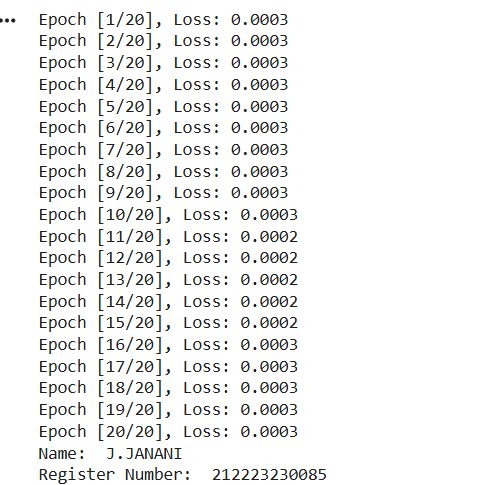
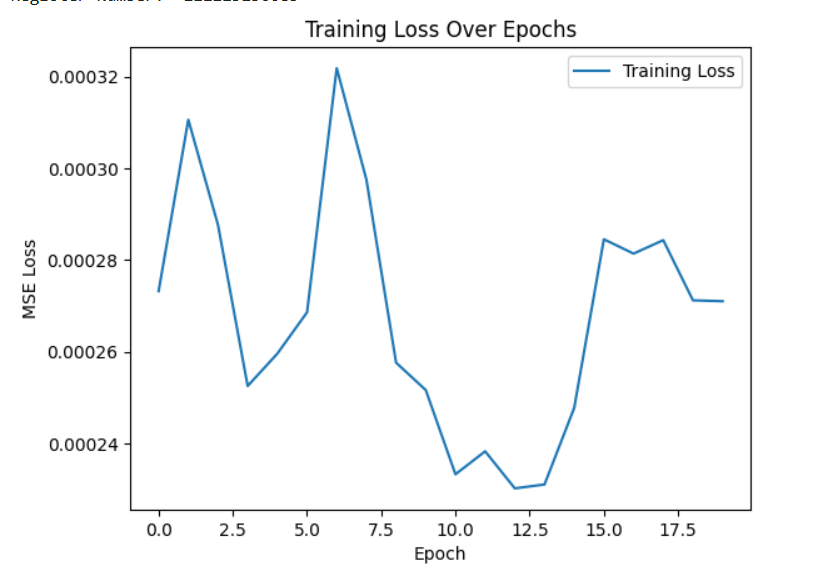
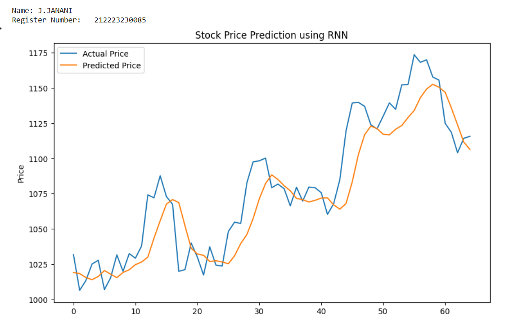
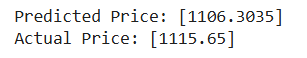

# DL- Developing a Recurrent Neural Network Model for Stock Prediction

## AIM
To develop a Recurrent Neural Network (RNN) model for predicting stock prices using historical closing price data.

## Problem Statement and Dataset

To design and implement a Recurrent Neural Network (RNN) that learns temporal patterns from historical stock closing prices and predicts future stock prices based on past trends. The dataset consists of historical stock market data containing daily closing prices of a selected company, which is preprocessed through normalization and sequence generation before being used for training and testing the RNN model.


## DESIGN STEPS
### STEP 1: 

Load and normalize data, create sequences.

### STEP 2: 

Convert data to tensors and set up DataLoader.

### STEP 3: 

Define the RNN model architecture.

### STEP 4: 

Summarize, compile with loss and optimizer.

### STEP 5: 

Train the model with loss tracking.

### STEP 6: 


Predict on test data, plot actual vs. predicted prices.


## PROGRAM

### Name:J.JANANI

### Register Number:212223230085

```python
# Define RNN Model
class RNNModel(nn.Module):
  def __init__(self,input_size=1,hidden_size=64,num_layers=2,output_size=1):
    super(RNNModel,self).__init__()
    self.rnn=nn.RNN(input_size,hidden_size,num_layers,batch_first=True)
    self.fc=nn.Linear(hidden_size,output_size)
  def forward(self,x):
    out,_=self.rnn(x)
    out=self.fc(out[:,-1,:])
    return out
model = RNNModel()
device = torch.device("cuda" if torch.cuda.is_available() else "cpu")
model = model.to(device)

##  Train the Model


def train_model(model, train_loader, criterion, optimizer, epochs=20):
    train_losses = []
    model.train()
    for epoch in range(epochs):
        total_loss = 0
        for x_batch, y_batch in train_loader:
            x_batch, y_batch =x_batch.to(device),y_batch.to(device)
            optimizer.zero_grad()
            outputs = model(x_batch)
            loss = criterion(outputs, y_batch)
            loss.backward()
            optimizer.step()
            total_loss += loss.item()
        train_losses.append(total_loss / len(train_loader))
        print(f"Epoch [{epoch+1}/{epochs}], Loss: {total_loss / len(train_loader):.4f}")
# Plot training loss
    print('Name:  J.JANANI  ')
    print('Register Number:  212223230085 ')
    plt.plot(train_losses, label='Training Loss')
    plt.xlabel('Epoch')
    plt.ylabel('MSE Loss')
    plt.title('Training Loss Over Epochs')
    plt.legend()
    plt.show()
train_model(model,train_loader,criterion,optimizer)


##  Make Predictions on Test Set
model.eval()
with torch.no_grad():
    predicted = model(x_test_tensor.to(device)).cpu().numpy()
    actual = y_test_tensor.cpu().numpy()

# Inverse transform the predictions and actual values
predicted_prices = scaler.inverse_transform(predicted)
actual_prices = scaler.inverse_transform(actual)

# Plot the predictions vs actual prices
print('Name:       J.JANANI   ')
print('Register Number:    212223230085   ')
plt.figure(figsize=(10, 6))
plt.plot(actual_prices, label='Actual Price')
plt.plot(predicted_prices, label='Predicted Price')
plt.xlabel('Time')
plt.ylabel('Price')
plt.title('Stock Price Prediction using RNN')
plt.legend()
plt.show()
print(f'Predicted Price: {predicted_prices[-1]}')
print(f'Actual Price: {actual_prices[-1]}')

```

### OUTPUT

## Training Loss Over Epochs Plot






## True Stock Price, Predicted Stock Price vs time




### Predictions




## RESULT


Thus, a Recurrent Neural Network (RNN) model for predicting stock prices using historical closing price data has been developed successfully.
